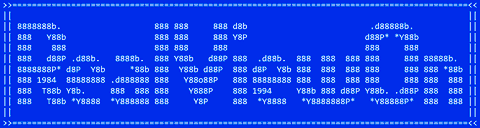

#   

**RealViewOn** its a tool to enhance and fix your SolidWorks installation.

## Key Features 🌟

- **Enable RealView 🛠️:** [Simplifies RealView Activation](https://github.com/ianalexis/RealViewOn/blob/main/assets/images/BeforeAfter.png) for [any GPU](#gpu), including non-certified ones, by creating a `.reg` file to run in a straightforward way without needing to browse regedit.  
  

- **Fixes Visual & Graphics Issues 🖼️:** Resolves many common [graphical errors and visual glitches](https://github.com/ianalexis/RealViewOn/blob/main/assets/images/SketchVisualError.png) users experience when enabling Enhanced Graphics Performance.  
  

- **Advanced Mode 🛠️:** Allows for [additional configurations](#advance-mode-️) to be made to the SolidWorks registry, such as enabling Dark Mode, FPS Viewer, and more.
- **Supports Old & New Methods 🕰️:** Works with both old and new methods as needed.
- **FULL USER CONTROL 🖐️:** This tool **DOES NOT apply any changes** directly. It simply generates a `.reg` file for you that you can read and decide to run or not.

## Operation Modes ⚙️

- **Smart 🤖:** Automatically detects and generates all keys.
- **Manual 📝:** Allows generating the files by requesting the missing information from the user when all required data cannot be obtained.

## Usage 📋

0. 🧑 MANUAL - [Download the latest version from Releases (exe or 7z) 📥](https://github.com/ianalexis/Real-View-On-Releases/releases).
1. 🤖 AUTO - The tool detects the installed versions of SolidWorks 🔍.
2. 📑 MANUAL - Select the SolidWorks version.
3. 🤖 AUTO - Search for the GPU used by that version of SolidWorks 🖥️.
   1. 🚧 In case no Renderer is found, the user will be prompted to select:
      1. 🔍 Renderers found in the registry.
      2. 🖥️ Display Adapters found in the Device Manager.
      3. ✍️ Manually enter the GPU model.
         1. 📝 Go to the Device Manager and search for the GPU under Display Adapters.
         2. 💻 Open the GPU properties and copy the name of the device under the Details tab.
         3. ⌨️ Enter the device name into the program and press Enter.
4. 🧑 OPTIONAL - Advance Mode.
   1. 🤖 AUTO - A backup file is generated.
   2. 📑 MANUAL - Select the desired options.
5. 🤖 AUTO - A custom `RealViewOn[SWVersion].reg` file will be generated📝.
6. ✨ MANUAL - Execution of the `.reg` file.
   1. 🕵️ OPTIONAL - Review (with any text editor) the `.reg` file.
   2. 🚀 MANUAL - Execute the `.reg` file by double clicking on it.

## Advance Mode 🛠️

Advanced mode includes a set of additional configurations that can be executed from the same `.reg` file.
Its main use is to avoid the SolidWorks Setting Wizard, which often retains unnecessary data and generates numerous conflicts.
This mode generates a complete backup of the SolidWorks registry with the name `RVO_Wbackup_YY-MM-DD_HH-MM.reg`.

- 🔄 **Reverse Mouse Wheel:** Reverses the mouse wheel direction.
- 🌑 **DarkMode:** Enables Dark Mode.
- 🎮 **FPS Viewer:** Shows the Frames Per Second in the 3D space.
- 🚀 **Performance Enhance graphics:** Enables the Performance Enhance graphics option and Hardware accelerated silhouette edges.
- 🖌️ **Full AntiAliasing:** Enables Full AntiAliasing instead of edges/sketches only.
- 📏 **Spin Box Increment:** Changes the mm steps from 10mm to 1mm.
- ⚙️ **QoL Commands:** Adds Quality of Life commands and tabs like
  - Toolbar:
    - "Normal To"
  - Direct Editing:
    - "Scale"
    - "Flex"
    - "Deform"
  - Tabs:
    - Surfaces
    - Weldments
    - etc.

## Solutions if something does not work 👩‍🔧🖥️

In case you find errors modify the `dword` values of the file with the examples for your brand to commented in the file.

### RealView does not work

Modify the `dword` values of GL2Shaders.

### Sketchs and visual errors

Modify the `dword` values of the brand.

## Contribute 🤝

We welcome any feedback regarding the functionality of the tool, whether it works or not.
If needed, we are happy to assist you , not only to ensure proper usage but also to identify potential areas for improvement.

### Workarounds

A great way to help us is to share with us the values of your SolidWorks installation.
Just download and run the [GetWorka.ps1](https://github.com/ianalexis/Real-View-On-Releases/blob/main/GetWorka.ps1) file and share the generated file with us.
It is simple, fast, safe, requires no technical knowledge and will help us to improve the tool.

### If you needed to change the values, please share:

- **Values:** `dword` values and changes in the `.reg` file.
- **Renderer:** GPU
- **SolidWorks version:** SW versions you want to enable RealView on.

## Compatibility 🖥️

### SolidWorks

Ready to work with any version after 2010, as it adapts the corresponding patch method according to the version.

> [!NOTE]
> It should even work in earlier versions, but these are considered obsolete. If you require compatibility with an older version, please raise an issue and it will be analyzed.

### GPU

- 🟢Nvidia ⭐⭐⭐⭐
- 🔴AMD ⭐⭐
- 🔵Intel ⭐⭐

#### *Reliability*
 - ⭐⭐⭐⭐⭐: [GPU Microarchitectures tested > 3] && [SW versions tested per generation > 2]
 - ⭐⭐⭐⭐: [GPU Microarchitectures tested > 2] && [SW versions tested per generation > 2]
 - ⭐⭐⭐: [GPUs tested > 1] && [SW versions tested > 1]
 - ⭐⭐: [Actual GPU tested]
 - ⭐: [Theoretical testing]

## Disclaimer ⚠️

This software facilitates enabling features in SolidWorks. Use it at your own discretion and responsibility.
SolidWorks & RealView are registered trademarks of Dassault Systèmes.

## Special Thanks 💖

- 👷 All the **users** that have contributed with feedback and testing.
- 👨‍💻 **Main Developers:**
  - [RF47](https://github.com/RF47) - Initial project development, logic engineering and MIDI implementation.
  - [Ian Alexis](https://github.com/ianalexis) - Project mantainer, developer lead, documentation.
- **📚 Libraries:**
  - **🎼 Midifile:** C++ MIDI file parsing [library](https://github.com/craigsapp/midifile).
  - **🎵 RtMidi:** C++ MIDI I/O [library](https://github.com/thestk/rtmidi).
- **📦 Tools:**
  - **🦇 LLVM Clang:** C++ [Compiler](https://clang.llvm.org/).
  - **🗜️ UPX:** Ultimate [Packer](https://github.com/upx/upx) for eXecutables.
  - **📦 7-Zip:** File [archiver](https://www.7-zip.org/).

## Star History

<a href="https://www.star-history.com/#ianalexis/RealViewOn&Date">
 <picture>
   <source media="(prefers-color-scheme: dark)" srcset="https://api.star-history.com/svg?repos=ianalexis/RealViewOn&type=Date&theme=dark" />
   <source media="(prefers-color-scheme: light)" srcset="https://api.star-history.com/svg?repos=ianalexis/RealViewOn&type=Date" />
   
 </picture>
</a>
